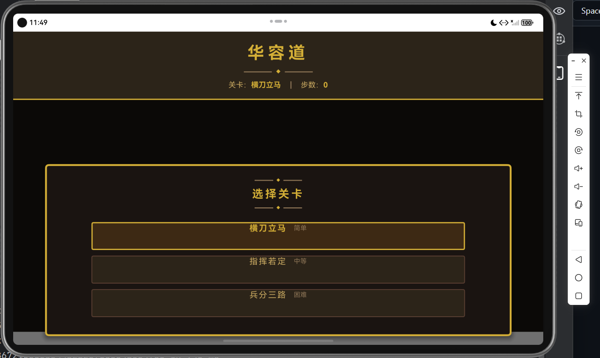
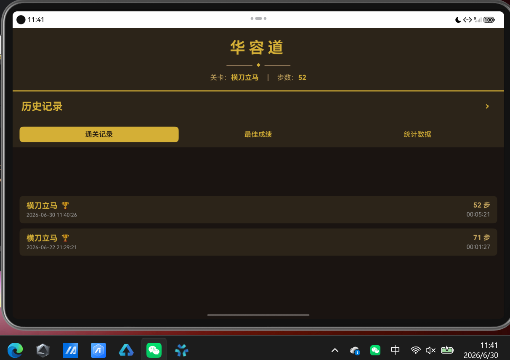
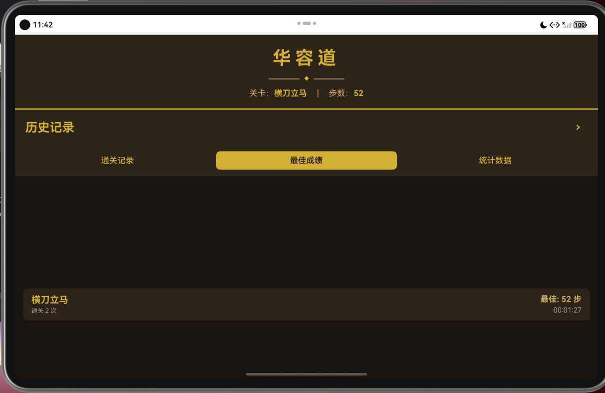
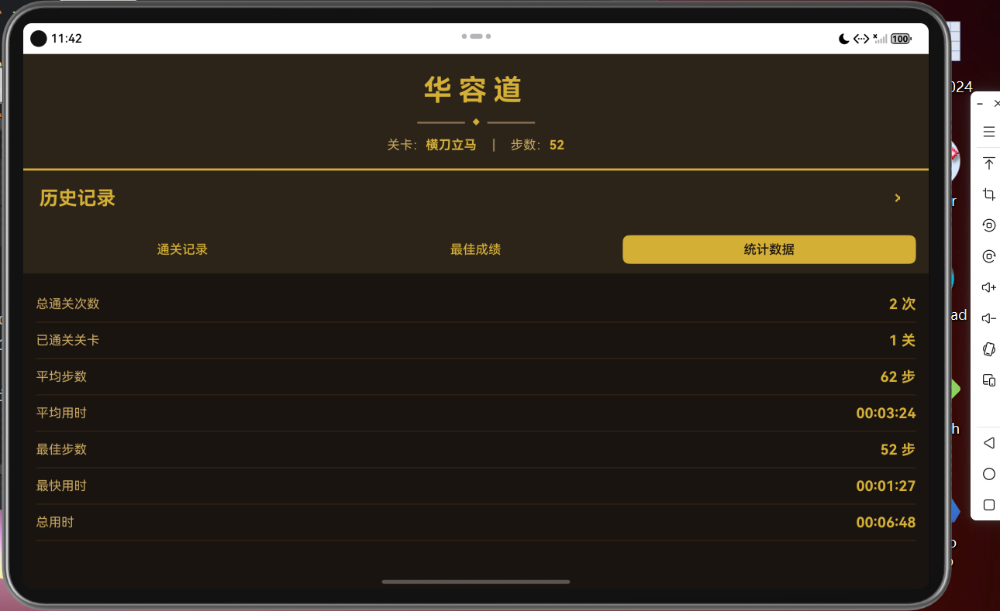
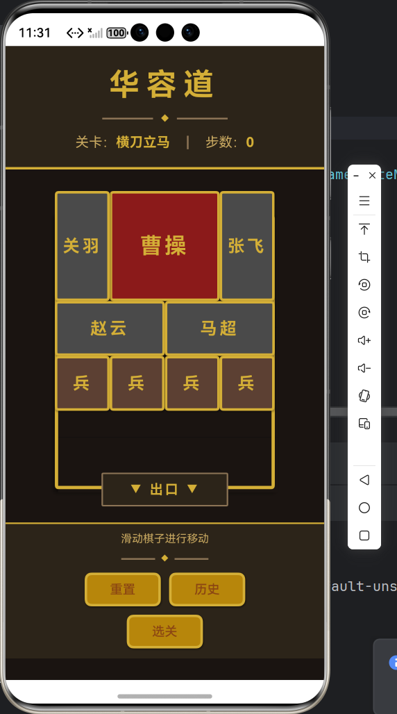
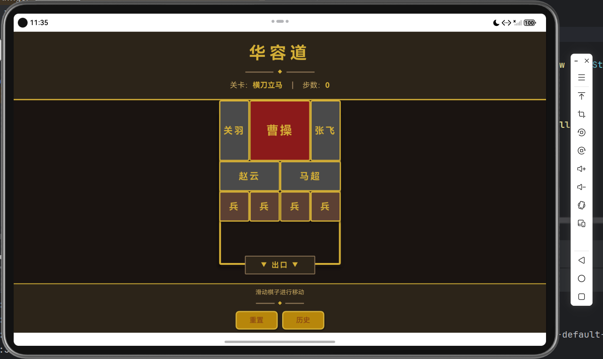
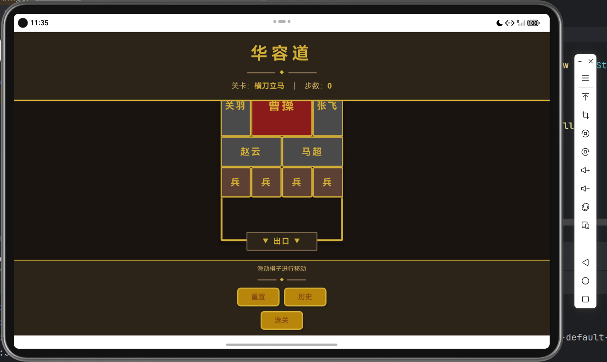
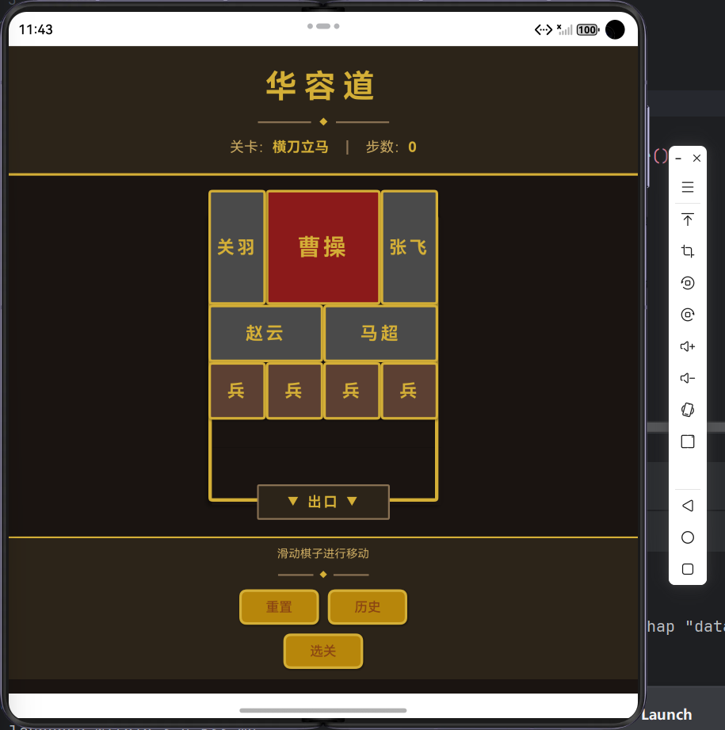

# 华容道游戏

一款基于 HarmonyOS 开发的经典华容道益智游戏，采用古风主题设计，支持通关记录持久化存储。

## 项目简介

华容道是中国传统益智游戏，目标是将最大的棋子"曹操"从棋盘顶部移动到底部出口。本游戏采用墨黑、朱砂红、暗金色等古风配色，营造古典雅致的游戏氛围。

## 功能特性

### 核心玩法
- **经典华容道规则**：移动棋子，让曹操从底部出口逃脱
- **滑动操作**：点击选中棋子后，滑动进行移动
- **实时反馈**：移动步数实时统计，通关时显示用时

### 关卡系统
- **横刀立马**（简单）：经典布局，适合新手入门
- **指挥若定**（中等）：需要一定策略思考
- **兵分三路**（困难）：挑战性布局，考验逻辑思维

### 记录系统（实现自由流转功能）
- **通关记录**：记录每次通关的关卡、步数、用时
- **最佳成绩**：自动保存每关最佳步数记录
- **统计数据**：总通关次数、平均步数、总用时等
- **持久化存储**：应用重启后记录不丢失

<center>所有记录系统界面</center>


<center>最佳成绩显示界面</center>


<center>总数据分析界面</center>

### 界面设计
- **古风主题**：墨黑背景、朱砂红曹操、暗金色装饰
- **木质棋盘**：褐色棋盘底色，营造古典氛围
- **流畅动画**：棋子移动平滑过渡
- **一次开发多端部署**：多端适配

<center>手机端界面</center>



<center>平板端界面可上下滑动</center>


<center>折叠屏界面</center>

## 技术架构

### 开发环境
- **开发框架**：HarmonyOS ArkTS
- **目标 SDK**：HarmonyOS 6.0.2(22)
- **开发工具**：DevEco Studio

### 项目结构
```
entry/src/main/ets/
├── models/              # 数据模型
│   ├── Piece.ets        # 棋子模型
│   ├── Level.ets        # 关卡模型
│   ├── BoardState.ets   # 棋盘状态
│   └── GameRecord.ets   # 通关记录模型
├── constants/           # 常量配置
│   └── GameConstants.ets # 游戏常量、颜色、文本
├── data/                # 数据配置
│   └── LevelData.ets    # 关卡数据
├── managers/            # 业务管理器
│   ├── GameStateManager.ets   # 游戏状态管理
│   ├── LevelManager.ets       # 关卡管理
│   ├── MoveValidator.ets      # 移动验证
│   ├── WinChecker.ets         # 胜利检测
│   └── RecordManager.ets      # 记录存储管理
├── components/          # UI组件
│   ├── GameHeader.ets   # 顶部标题栏
│   ├── GameBoard.ets    # 棋盘组件
│   ├── GameFooter.ets   # 底部控制栏
│   ├── PieceBlock.ets   # 棋子组件
│   ├── LevelSelector.ets # 关卡选择器
│   └── HistoryPage.ets  # 历史记录页面
└── pages/               # 页面
    └── Index.ets        # 主页面
```

### 核心技术
- **状态管理**：使用 `@State` 装饰器实现响应式 UI
- **数据持久化**：使用 `Preferences` API 保存通关记录
- **单例模式**：RecordManager 采用单例模式管理全局记录
- **组件化设计**：UI 拆分为独立可复用组件

## 棋子说明

| 棋子 | 尺寸 | 颜色 | 说明 |
|------|------|------|------|
| 曹操 | 2×2 | 朱砂红 | 目标棋子，需移至底部出口 |
| 武将 | 1×2 或 2×1 | 墨灰色 | 关羽、张飞、赵云、马超 |
| 兵卒 | 1×1 | 深褐色 | 四个小兵 |

## 游戏规则

1. 棋盘为 4×5 格子，底部中央有 2 格宽的出口
2. 点击棋子选中，滑动方向移动
3. 棋子只能沿直线移动，不能跨越其他棋子
4. 目标：将曹操移动到棋盘底部，完全覆盖出口位置

## 安装运行

### 前置条件
- 安装 DevEco Studio
- 配置 HarmonyOS SDK

### 运行步骤
1. 使用 DevEco Studio 打开项目
2. 连接 HarmonyOS 设备或启动模拟器
3. 点击运行按钮安装应用

## 操作说明

- **选中棋子**：点击棋子，显示金色选中边框
- **移动棋子**：选中后滑动方向键或直接滑动
- **重置关卡**：点击"重置"按钮恢复初始布局
- **选择关卡**：点击"选关"按钮切换关卡
- **查看记录**：点击"历史"按钮查看通关记录

## 版本历史

### v1.0.0
- 实现经典华容道游戏核心玩法
- 添加 3 个关卡（简单、中等、困难）
- 实现古风主题 UI 设计
- 添加通关记录持久化存储
- 支持历史记录、最佳成绩、统计数据查看

## 许可证

本项目仅供学习和研究使用。
